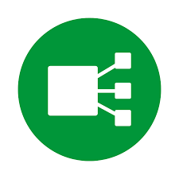

# 👋 Hi, I’m Daniel

I'm a **Developer / DevOps / SRE** passionate about building reliable, automated, and scalable platforms.  
I have tons of fun working with **Kubernetes, cloud-native tools, automation, and backend development**.

---

### 🌟 Featured Projects

#### 🚀 [**DevOps Quests**](https://github.com/danielnegreiros/devops-quests)  
A hands-on collection of challenges and guides for building cloud-native features as a plug-and-play platform.

  <code></code>
  <code></code>
  <code></code>
  <code></code>
  <code></code>
  <code></code>

---

#### 🔐 [**Vault Local Auto Unlocker**](https://github.com/danielnegreiros/vault-local-auto-unlocker)  
A lightweight **Go tool** to automate Vault auto-unsealing locally (mostly for dev environments) using GitHub Actions & Docker.  
It also provisions **random secrets** for Kubernetes Pods.

  <code></code>
  <code></code>
  <code></code>
  <code></code>
  <code></code>

---

### 🛠️ Other Tech Tools I Use & Enjoy

  <code></code>
  <code></code>
  <code></code>
  <code></code>
  <code></code>
  <code></code>

---

### 📊 GitHub Stats

---

### 🌐 Connect with Me

  
  

